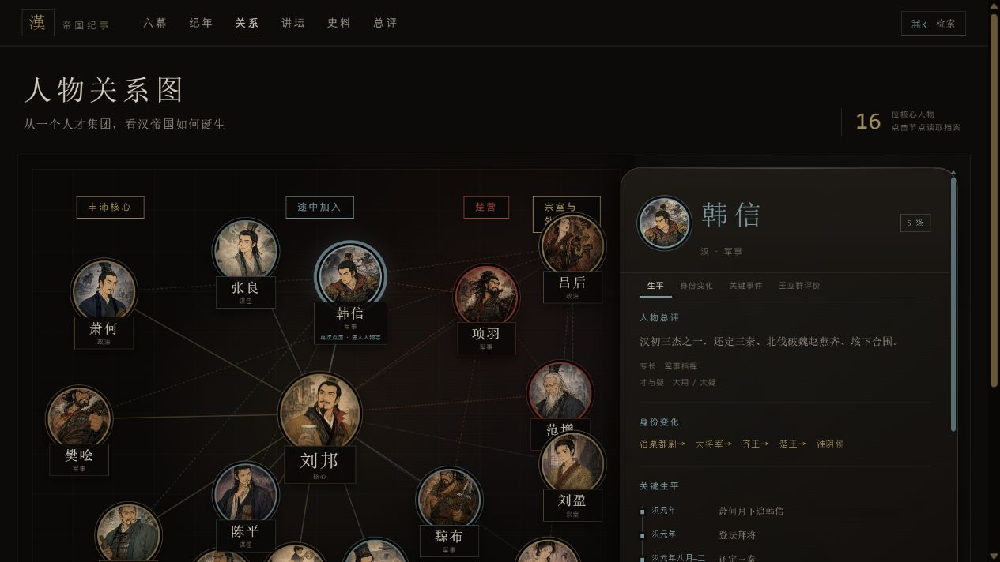
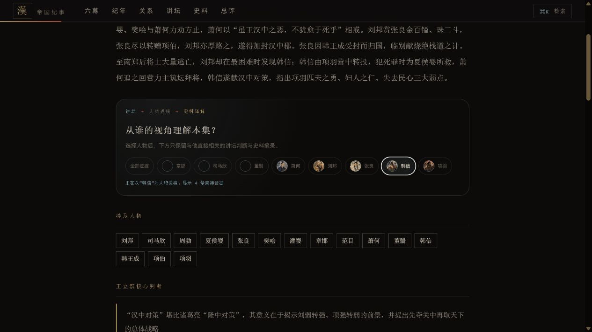
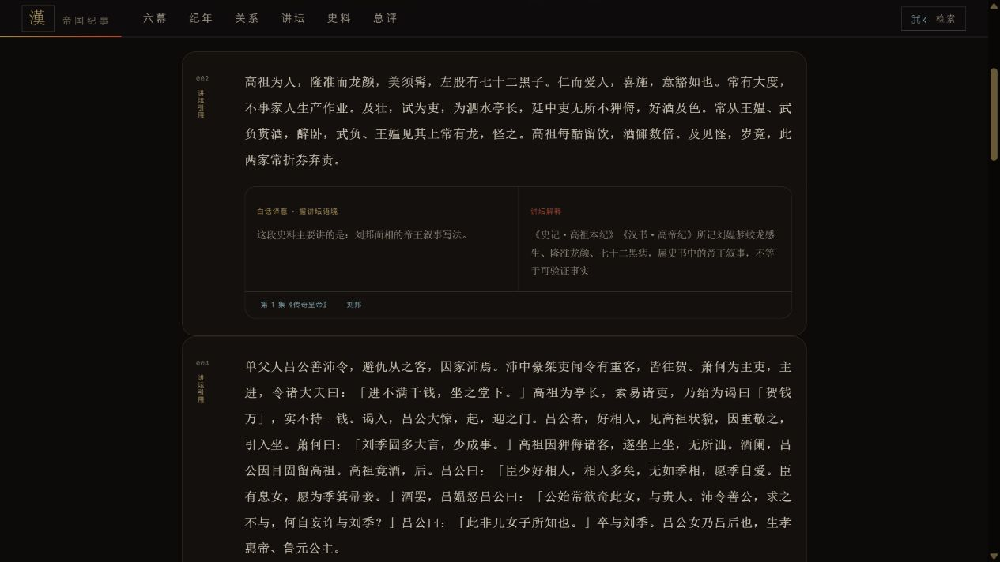

# 汉 · 帝国纪事：大风歌

一个用来整理看过的《百家讲坛》的交互式历史笔记网站。第一卷围绕王立群《大风歌》45 集展开，把原本线性的节目内容重新组织为人物、事件、关系、时间线、讲坛观点与史料证据。

它不复刻节目，也不把讲坛观点当作史实；它更像一张可以反复回看的“汉初知识地图”。

## 项目截图

### 人物关系图

用圆形人物肖像代替普通矩形节点，点击人物后会打开悬浮档案，可查看生平、身份变化、关键事件与评价。



### 人物 × 讲坛 × 史料证据链

从人物档案直接切换到相关集数，同时对照讲坛判断、史料原句、白话译意与讲坛解释。


### 讲坛人物透镜

在单集页面选择人物，只保留与该人物直接相关的判断和史料，适合追踪同一人物跨集发生的变化。



### 史料译解阅读器

史料页提供“原文通读 / 译解对照 / 只看讲坛证据”三种模式，并能返回对应人物与节目集数。



## 核心内容

| 模块 | 用途 |
| --- | --- |
| 六幕 | 按叙事阶段回看 45 集节目 |
| 河流纪年 | 用连续河道式时间线串起前 211 年至前 195 年的关键事件 |
| 人物关系图 | 浏览 16 位核心人物的关系网络，并打开悬浮人物档案 |
| 人物主页 | 汇总 111 位人物的生平、身份变化、关键事件、总评与相关节目 |
| 讲坛人物透镜 | 在每一集中按人物筛选讲坛判断与直接证据 |
| 史料阅读器 | 收录《史记》20 篇、《资治通鉴》6 卷，串联节目引文、白话译意与解释 |
| 总评 | 从自信、魅力、用人等维度组织评价，同时保留局限与反例 |
| 全局检索 | 跨人物、事件、关系、讲坛与史料检索；面板可随时关闭 |

## 阅读方法

推荐从任意一位人物开始：

1. 在关系图中点击人物，快速了解其身份与关键经历。
2. 进入人物主页，在“讲坛现场”中选择一集。
3. 对照王立群的判断与本集引用的史料。
4. 进入史料全文，用“只看讲坛证据”定位原文语境。
5. 再返回人物或节目页，继续追踪同一人物的关系和命运变化。

浏览器返回键会回到上一个实际浏览页面，而不是固定跳回首页。

## 内容边界

网站明确区分以下内容：

- **史料原文**：来自《史记》《资治通鉴》等古籍。
- **原文直译**：仅在已建立可靠对应关系的引文上使用。
- **白话译意 · 据讲坛语境**：帮助理解节目引用段落，属于语境化释义，不冒充整章权威译本。
- **讲坛解释 / 评价**：标明为王立群节目中的解释或评价，不与可核验史实混同。
- **帝王传奇叙事**：如蛟龙感生、斩白蛇、望云气，明确标注为史书记载的叙事，不等于可验证事实。

目前的翻译与解释重点覆盖节目实际引用到的段落，并非《史记》《资治通鉴》全书译本。

## 本地运行

项目是零构建静态网站，只需要一个本地 HTTP 服务：

```powershell
python -m http.server 8771 --bind 127.0.0.1 --directory han/site
```

然后打开 <http://127.0.0.1:8771/>。

无需安装前端依赖；核心界面使用原生 HTML、CSS 与 JavaScript。

## 数据与目录

```text
han/
├── content/
│   ├── extracted/       # 45 集节目内容的结构化抽取
│   ├── data/            # 人物、事件、关系、讲坛、史料与总评数据
│   └── shiji/           # 史料原文与核验材料
├── site/
│   ├── index.html       # 网站入口
│   └── assets/
│       ├── js/          # 应用与数据
│       ├── css/         # 界面、分层滚动与动效
│       └── img/people/  # AI 生成的人物示意图
├── docs/                # 内容审计、研究记录与项目截图
└── smoke.js             # 261 条路由的静态冒烟测试
```

运行检查：

```powershell
node han/smoke.js
```

## 视觉与交互

整体使用黑漆、朱红、旧帛与暗金配色。关系节点采用圆形肖像，人物档案使用类似 macOS 浮层的独立滚动卡片；页面、检索面板和人物卡片分别拥有自己的滚动层级，避免滚动串层。

人物图片均为 AI 生成的历史题材示意形象，不是历史真实肖像，也不具史料效力。

## 权利与许可

- 代码：MIT，见 [LICENSE](LICENSE)。
- 项目整理数据与原创说明文字：CC BY-NC-SA 4.0。
- 《史记》《资治通鉴》原文属于公有领域。
- 《百家讲坛》节目及相关文字内容的著作权归原权利人所有。本项目仅用于个人观看整理、学习与非商业研究，不提供节目视频，也不以替代原节目为目的。
